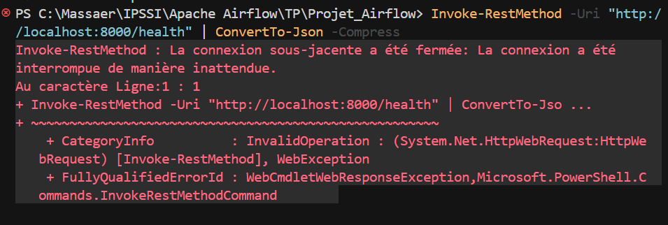

# Partie Classification - NLP Service

## Ce que fait ta partie
- Service FastAPI `nlp-service` sur le port `8000`
- Endpoint `POST /classify` pour classifier un texte (topic + confidence)
- Endpoint `POST /enrich` pour enrichir un batch d'articles (utilise par le DAG ML)
- Endpoint `GET /health` pour verifier l'etat du service
- Contrat JSON stable pour l'integration Airflow
- Endpoint `POST /sentiment` present (partie partagee avec ton binome)

## Modeles utilises (reels)
- Topic classification : `valhalla/distilbart-mnli-12-3` (zero-shot)
- Sentiment : `cardiffnlp/twitter-roberta-base-sentiment-latest`

## Lancer
Tout le stack (Airflow, Postgres, Redis, MinIO, OpenSearch, `nlp-service`, etc.) est dans **`docker-compose.yml`** à la racine du projet (sans Kafka : ingestion non incluse ici).

Prérequis : fichier **`.env`** (copie de `.env.example` si besoin).

```bash
docker compose up -d --build
```

## Verifier
```bash
curl http://localhost:8000/health
```

## Exemple classify
```bash
curl -X POST http://localhost:8000/classify \
  -H "Content-Type: application/json" \
  -d "{\"text\":\"OpenAI sort un nouveau modele\", \"labels\": [\"tech\", \"politics\", \"business\"]}"
```

## Reponse attendue
```json
{
  "topic": "tech",
  "confidence": 0.86,
  "model": "baseline-rule-v2"
}
```

## Exemple enrich (batch)
```bash
curl -X POST http://localhost:8000/enrich \
  -H "Content-Type: application/json" \
  -d "{\"batch\":[{\"id\":\"a1\",\"url\":\"https://ex.com/1\",\"title\":\"news\",\"body\":\"AI market shows strong growth\"}], \"labels\":[\"tech\",\"politics\",\"business\",\"sports\"]}"
```

## Exemple enrich (PowerShell)
```powershell
$body = @{
  batch = @(
    @{ id = "a1"; url = "https://ex.com/1"; title = "news"; body = "AI market shows strong growth" }
  )
  labels = @("tech", "politics", "business", "sports")
} | ConvertTo-Json -Depth 5
Invoke-RestMethod -Uri "http://127.0.0.1:8000/enrich" -Method Post -ContentType "application/json" -Body $body
```
(Le premier appel peut prendre plusieurs minutes : chargement des modeles + inference.)

## Integration avec le LAB (recommande)

Le `docker-compose.yaml` du dossier **LAB** (`Apache Airflow\LAB`) inclut desormais le service **`nlp-service`** (build depuis ce projet) sur le meme reseau Docker qu’Airflow 3, et definit la Variable `nlp_service_url` via `AIRFLOW_VAR_NLP_SERVICE_URL`.

1. Ouvre un terminal dans le **LAB** :  
   `cd "...\Apache Airflow\LAB"`
2. Lance la stack (premier build NLP long) :  
   `docker compose up -d --build`
3. UI Airflow : [http://localhost:8080](http://localhost:8080) (admin / admin selon ton compose LAB).
4. DAG **`newsradar_nlp_endpoints_demo`** : declenche-le manuellement — il enchaine **health → classify → sentiment → enrich** et affiche chaque reponse JSON dans les logs des taches.
5. DAG **`newsradar_enrich_ml`** : batch demo `POST /enrich` (schedule quotidien, ou declenchement manuel).

Les fichiers DAG correspondants sont dans **`LAB\dags\`** (et copies dans **`Projet_Airflow\dags\`** pour ton depot TP).

**Ports** : sur le **LAB**, le NLP est expose en **8001** sur ta machine (`http://127.0.0.1:8001/health`) pour eviter le conflit avec le compose **Projet** qui utilise **8000**. Airflow dans Docker utilise toujours **`http://nlp-service:8000`** (reseau interne).

**Sans rebuilder le LAB** (NLP deja lance avec `Projet_Airflow\docker compose` sur le port 8000) : dans Airflow, definis la Variable `nlp_service_url` = `http://host.docker.internal:8000`.

## DAG Airflow `newsradar_enrich_ml` (MinIO + etapes visibles)

Fichier : `dags/newsradar_enrich_ml.py` — le **graphe Airflow** montre : chargement (MinIO ou demo) → **`nlp_classify_all`** (`POST /classify`) → **`nlp_sentiment_all`** (`POST /sentiment`) → **`merge_enrichment`** (fusion = enrichissement logique) → persistance (placeholder). Meme travail ML que l’ancien appel unique a `/enrich`, mais **une tache par etape** pour la lisibilite.

**MinIO (fichiers JSON)** : definis les Variables Airflow suivantes (Admin > Variables), ou utilise les `AIRFLOW_VAR_*` du `docker-compose.yml` :

| Cle | Exemple | Role |
|-----|---------|------|
| `newsradar_minio_prefix` | `raw/articles/` | Prefixe des objets a lire (fichiers **`.json`**). Si vide, le DAG utilise les 3 articles **demo**. Sur le **LAB**, cette variable est pre-remplie par `docker-compose` + les fichiers d’exemple sont deposes par **`minio-init`** (`LAB/init-minio/newsradar-json/`). |
| `newsradar_minio_bucket` | `data-lake` | Bucket (defaut `data-lake` comme le LAB). |
| `newsradar_minio_max_files` | `50` | Nombre max de fichiers `.json` listes par run. |

Connexion AWS/S3 : **`minio_local`** (deja dans le compose LAB). Chaque JSON doit contenir au moins un champ texte : `body`, `text`, `content` ou `article_body` ; id : `id`, `article_id` ou `_id`.

**Frequence** : dans le code, le DAG est planifie en **`timedelta(minutes=15)`** ; adapte selon la charge NLP ; `max_active_runs=1` evite les chevauchements.

Postgres pour marquer les articles deja enrichis : a ajouter dans `persist_enrichments_placeholder` quand le schema est pret.

**Re-deposer les JSON sur MinIO** (si le bucket existait deja avant cette etape) : depuis le dossier LAB,  
`docker compose run --rm minio-init`

**Fichiers d’exemple** : copies identiques dans `Projet_Airflow/minio-sample-articles/` et `LAB/init-minio/newsradar-json/`.

## DAG demo `newsradar_nlp_endpoints_demo`

Fichier : `dags/newsradar_nlp_endpoints_demo.py` — teste tout le contrat JSON (classify, sentiment, enrich) en une execution.

## URL interne Docker pour Airflow
`http://nlp-service:8000/enrich` (batch) ou `http://nlp-service:8000/classify` (un texte)
