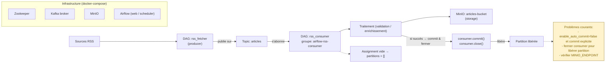
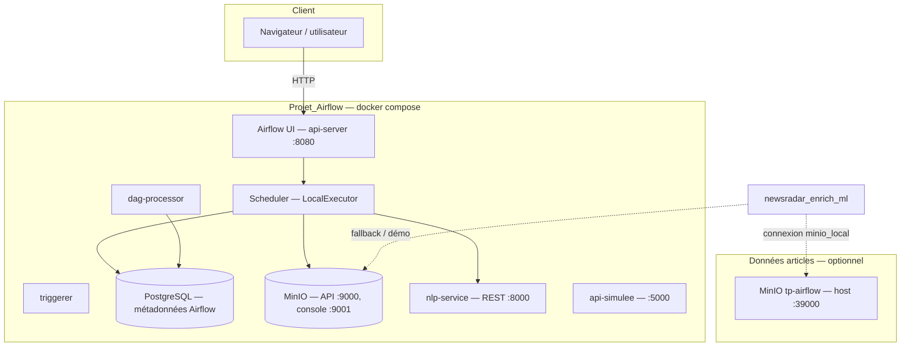

# Projet Newsradar — Équipe 6

## Membres
- Aurélien L — Ecriture des flux RSS (avec DAGs et Kafka, stockage de ceux-ci dans MinIO)
- Massaer D — Ecriture du service NLP (classification zero-shot + sentiment + enrichissement NLP) et intégration dans les DAGs Airflow

---

## 1) Partie commune : ingestion RSS / Kafka / MinIO (tp-airflow)

## Stack
- Airflow 2.7.1
- Kafka 3 (Bitnami)
- MinIO (stockage objet)
- Zookeeper 3
- Docker Compose

| DAG           | Rôle                                                                 | Schedule                    |
|---------------|----------------------------------------------------------------------|-----------------------------|
| `rss_fetcher`   | Récupère les flux RSS, normalise les articles et publie sur Kafka `articles` | Configurable (ex: 5 min)    |
| `rss_consumer`  | Consomme `articles`, traite chaque message (NLP + enrichissement) et stocke dans MinIO `articles-bucket` | Continu (polling) |

## Topics et groupes
- Topic Kafka : `articles`
- Groupe consumer : `airflow-rss-consumer`

## Lancement rapide
```bash
# 1) Lancer les services
docker compose up -d

# 2) Attendre ~60s que tout démarre
sleep 60

# 3) Créer le topic Kafka
docker exec -it $(docker ps -qf "name=kafka") bash -c "kafka-topics.sh --create --topic articles --bootstrap-server localhost:9092 --partitions 1 --replication-factor 1" || echo "Topic exists ou erreur."

# 4) Créer le bucket MinIO (optionnel)
docker run --rm --network host minio/mc alias set myminio http://localhost:9000 minioadmin minioadmin && docker run --rm --network host minio/mc mb myminio/articles-bucket || echo "Bucket exists."

# 5) Accéder à l'UI Airflow
# - http://localhost:8080  (admin/admin) : stack Projet_Airflow (NLP / enrichissement)
# - http://localhost:38080 (admin/admin) : stack tp-airflow (ingestion), si vous lancez les deux stacks en même temps

# 6) Vérifier les logs
docker compose logs -f airflow-scheduler
```

## Choix techniques
- Airflow + SequentialExecutor : orchestration simple et lisible pour le développement. Permet de gérer le consumer Kafka proprement avec `close()` entre les exécutions et évite les deadlocks.
- Kafka (Bitnami) : découplage producteur/consommateur, garantit la durabilité des messages et facilite le scaling futur.
- MinIO : stockage objet compatible S3, simple à déployer en local et migrable vers S3/GCS en production.
- Commit manuel : garantit que les partitions Kafka se libèrent après traitement et upload réussi dans MinIO. Évite les accumulations d'offsets et les messages non traités.
- DAG `rss_consumer` avec polling continu : permet de traiter les articles dès leur arrivée sur Kafka sans attendre un schedule fixe.

## Contraintes techniques observées (ajout)
- Sur machine locale, la combinaison Airflow + Kafka + MinIO + NLP peut augmenter fortement la charge.
- Les étapes NLP (zero-shot + sentiment + enrichissement) peuvent rallonger les traitements en fonction du volume d’articles.
- Le réglage des retries/timeouts et le contrôle du flux (polling/commit) sont essentiels pour garder une exécution stable.

## Architecture (ingestion)


---

## 2) Partie NLP / enrichissement : Projet_Airflow

> **Contexte dossier `TP` :** ce projet s’utilise souvent avec **`tp-airflow`** (ingestion → MinIO). Vue d’ensemble des deux stacks : **[`../README.md`](../README.md)**.

Projet de formation : orchestration avec **Apache Airflow 3**, **MinIO** (S3-compatible), et un **service NLP** (classification zero-shot + sentiment) pour enrichir des articles issus d’un flux type RSS (via un autre stack `tp-airflow` optionnel).

## Structure du dépôt (livrables)

| Emplacement | Rôle |
|-------------|------|
| `dags/` | DAGs Airflow (pipelines métier). |
| `plugins/hooks/` | Hooks personnalisés (ex. `minio_hook.py`). |
| `plugins/operators/` | Opérateurs personnalisés (répertoire prévu pour extensions). |
| `nlp-service/` | API FastAPI des modèles ML (Hugging Face). |
| `api/` | API simulée utilisée pour les connexions Airflow de démo. |
| `scripts/` | Utilitaires (ex. nettoyage des exécutions en échec, déclenchement). |

## Schéma d’architecture (NLP)


En chaîne complète avec **tp-airflow** : les fichiers `articles_*.json` sont déposés dans le bucket **`data-lake`** sur le MinIO exposé en **39000** ; ce projet lit ces objets via `AIRFLOW_CONN_MINIO_LOCAL` (`host.docker.internal:39000`).

## Instructions de lancement

### Prérequis
- **Docker** et **Docker Desktop** (Windows : WSL2 recommandé).
- Ports libres notamment : **8080** (Airflow), **5432** (Postgres métadonnées), **9000/9001** (MinIO projet), **8000** (NLP).

### Démarrage standard
```bash
docker compose up -d
```

La première montée peut prendre plusieurs minutes (téléchargement d’images, `airflow db migrate`, installation des dépendances Python listées dans `docker-compose.yml`).

### OpenSearch (optionnel, profil `search`)
```bash
docker compose --profile search up -d
```

### Chaîne avec le data lake partagé (tp-airflow)
Pour alimenter MinIO avec les articles RSS **et** lancer l’enrichissement sur ces fichiers, démarrer aussi le stack **tp-airflow** (voir le dépôt `tp-airflow`, fichier `compose.parallel-projet.yaml`) afin que **MinIO** écoute sur **39000** côté hôte.

### Accès à l’interface
- **URL :** [http://localhost:8080](http://localhost:8080)  
- **Compte par défaut :** `admin` / `admin` (défini au premier `airflow-init`, sauf modification du `.env`).

### Scripts utiles
- `scripts/cleanup_failed_and_trigger_newsradar.ps1` : supprime les exécutions **FAILED** du DAG `newsradar_enrich_ml` puis déclenche une nouvelle run (nécessite le volume `./scripts` monté — voir `docker-compose.yml`).

## Liste des DAGs et leur rôle

| DAG | Rôle |
|-----|------|
| **`newsradar_enrich_ml`** | Pipeline principal « NewsRadar » : vérifie le NLP (`/health`), charge des articles depuis **MinIO** (préfixe `articles_`, bucket configurable) ou mode démo, appelle **`/classify`** puis **`/sentiment`** par article, fusionne les résultats (topic + sentiment), journalise un résumé en fin de chaîne. Planification toutes les 15 minutes ; peut être déclenché manuellement. |
| **`newsradar_nlp_endpoints_demo`** | Démonstration des endpoints du `nlp-service` : enchaîne `GET /health`, `POST /classify`, `POST /sentiment`, `POST /enrich` avec un texte fixe — utile pour valider que le service NLP répond avant de lancer le pipeline complet. |

Variables / connexions importantes (voir `docker-compose.yml` et `README_NLP.md`) :
- `AIRFLOW_VAR_NLP_SERVICE_URL` — URL du service NLP dans le réseau Docker (`http://nlp-service:8000`).
- `AIRFLOW_CONN_MINIO_LOCAL` — MinIO partagé avec tp-airflow (`host.docker.internal:39000`) ou MinIO local au projet.
- Limites de charge pour le lab : `AIRFLOW_VAR_NEWSRADAR_MINIO_MAX_FILES`, `AIRFLOW_VAR_NEWSRADAR_MAX_ARTICLES`.

## Résultats attendus

1. **Après `docker compose up -d`**  
   - Conteneurs **healthy** : `postgres-airflow`, `minio`, `airflow-apiserver`, `airflow-scheduler`, `nlp-service`, etc.  
   - Interface Airflow accessible sur le port **8080**.

2. **DAG `newsradar_nlp_endpoints_demo`**  
   - Exécution **succès** : toutes les tâches au vert ; les logs montrent les réponses JSON du service NLP.

3. **DAG `newsradar_enrich_ml`**  
   - **Succès** : graphe vert de `check_nlp_health` → `load_articles_to_enrich` → `nlp_classify_all` / `nlp_sentiment_all` (en parallèle) → `merge_enrichment` → `persist_enrichments_placeholder`.  
   - Les **résultats détaillés** (topics, scores de sentiment) apparaissent dans les **logs** des tâches (notamment `merge_enrichment`). La persistance vers Postgres/OpenSearch est laissée en **placeholder** dans le code actuel.

4. **Avec tp-airflow et fichiers dans `data-lake`**  
   - Les objets `articles_*.json` sont lus ; sinon le DAG peut retomber sur des **articles de démonstration** si aucun JSON exploitable n’est trouvé.

5. **Performances**  
   - Le NLP sur **CPU** peut rendre une run longue (plusieurs minutes selon le nombre d’articles). Les variables de limite (`max` fichiers / articles) permettent de réduire la durée en environnement de formation.

## Documentation complémentaire
- Détails NLP et endpoints : **`README_NLP.md`**.
