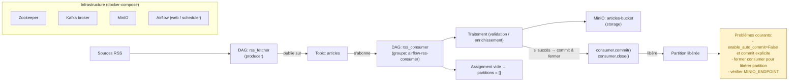

# Flux RSS

## Vue d'ensemble
Ce projet orchestre la collecte et le traitement d'un flux RSS via Airflow, Kafka et MinIO. Le producteur récupère les entrées RSS et publie des messages sur le topic Kafka `articles`. Le consommateur lit `articles`, traite chaque message et sauvegarde le résultat dans le bucket MinIO.

## DAGs
- `rss_fetcher`
    - Rôle : récupérer les flux RSS, normaliser les articles et produire des messages sur le topic Kafka `articles`.
    - Fréquence : configurable (ex: toutes les 5 min).

- `rss_consumer`
    - Rôle : consommer `articles` (groupe consumer `airflow-rss-consumer`), traiter chaque message et stocker l'objet résultant dans le bucket MinIO (ex: `articles-bucket`).
    - Comportement important : commit manuel des offsets après succès et fermeture propre du consumer pour libérer la partition.

## Topics et groupes
- Topic Kafka : `articles`
- Groupe consumer : `airflow-rss-consumer`
- Si une instance reste dans le groupe sans quitter proprement, elle peut garder la partition occupée : il faut s'assurer que le consumer effectue un commit et se ferme (`consumer.commit()` puis `consumer.close()`).

## Stockage MinIO
- Bucket recommandé : `articles-bucket`
- Variables d'environnement attendues : `MINIO_ENDPOINT`, `MINIO_ACCESS_KEY`, `MINIO_SECRET_KEY`, `MINIO_BUCKET`
- Erreur courante : `LocationValueError: No host specified.` signifie généralement que `MINIO_ENDPOINT` est absent ou mal configuré.

## Bonnes pratiques pour libérer les partitions
- Désactiver l'auto-commit (`enable_auto_commit=False`) et effectuer un commit explicite après succès du traitement et de l'upload vers MinIO.
- Après commit, appeler `consumer.close()` (ou `consumer.unsubscribe()` puis `consumer.close()`) pour quitter le groupe et libérer la partition.

## Notes de dépannage rapides
- `InvalidSessionTimeoutError` : vérifier la valeur `session_timeout_ms` du consumer (doit être dans la plage acceptée par le broker).
- `NodeNotReadyError` / `MemberIdRequiredError` : problèmes temporaires de coordination Kafka — retenter la jointure du groupe.
- Empty assignment (mise à jour des partitions à `[]`) : soit le topic n'a pas de partitions, soit le consumer n'a pas de permissions, soit la configuration du subscription filter ne matche rien.

# bash
# 1) Lancer les services
docker compose up -d

# 2) Créer le topic Kafka (exécuter dans le conteneur kafka)
docker exec -it $(docker ps -qf "name=kafka") bash -c "kafka-topics.sh --create --topic articles --bootstrap-server localhost:9092 --partitions 1 --replication-factor 1" || echo 'Créer le topic via votre outil Kafka si la commande diffère.'

# 4) Vérifier logs Airflow / consumer pour s'assurer qu'on upload vers MinIO (et que MINIO_ENDPOINT est défini)
docker compose logs -f airflow-web

## Architecture et flux

