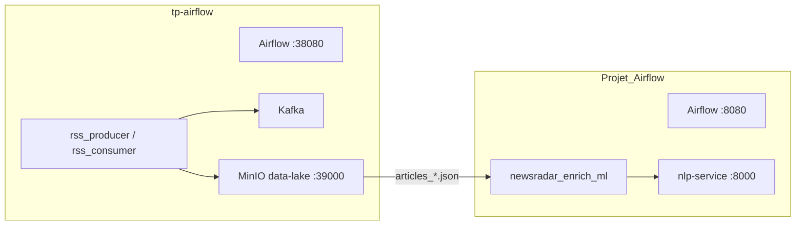

# TP — Apache Airflow (stack complète)

Ce dossier **`TP`** regroupe **deux projets Docker complémentaires** :

| Dossier | Rôle |
|---------|------|
| **[`tp-airflow/`](tp-airflow/)** | Stack **ingestion** : Airflow (port **38080**), **Kafka**, **RSS** (`rss_producer` / `rss_consumer`), **MinIO** exposé en **39000** / console **39001**, NLP, bases, etc. Les articles sont écrits en JSON dans le bucket **`data-lake`** (préfixe `articles_`). |
| **[`Projet_Airflow/`](Projet_Airflow/)** | Stack **orchestration NLP / lab** : second Airflow (port **8080**), DAG **`newsradar_enrich_ml`** qui lit les JSON sur MinIO (souvent le MinIO de **tp-airflow** via `host.docker.internal:39000`), service **NLP**, MinIO local optionnel. |

Enchaînement typique : **tp-airflow** alimente le lac → **Projet_Airflow** enrichit les articles (classification + sentiment).

### Dépôt Git (monorepo)

Ce dossier **`TP`** est la **racine du dépôt** : un seul clone contient **`tp-airflow/`** et **`Projet_Airflow/`**.

```powershell
git clone https://github.com/massdiagne/apache-airflow-tp.git
cd apache-airflow-tp
```

(Publier : créer le dépôt vide **`apache-airflow-tp`** sur GitHub sous le compte **massdiagne**, puis `git push -u origin main` depuis ce dossier.)

---

## Schéma d’ensemble (Mermaid)



---

## Démarrage rapide (les deux stacks)

1. **Terminal 1 — tp-airflow** (ingestion + MinIO partagé) :

   ```powershell
   cd tp-airflow
   docker compose -f compose.yaml -f compose.parallel-projet.yaml up -d
   ```

   - UI Airflow ingestion : **http://localhost:38080** (`admin` / `admin` par défaut).  
   - Console MinIO : **http://localhost:39001** (`minio_admin` / `minio_password_2026`).

2. **Terminal 2 — Projet_Airflow** (NLP + enrichissement) :

   ```powershell
   cd Projet_Airflow
   docker compose up -d
   ```

   - UI Airflow projet : **http://localhost:8080** (`admin` / `admin` par défaut).

**Ressources machine :** faire tourner les deux en parallèle est **lourd** (RAM / CPU). En cas d’instabilité Docker, ne lancer qu’**une** stack à la fois ou augmenter la mémoire allouée à Docker Desktop.

---

## Ports utiles (rappel)

| Service | Hôte (tp-airflow + `compose.parallel-projet.yaml`) | Hôte (Projet_Airflow) |
|--------|-----------------------------------------------------|------------------------|
| Airflow UI | **38080** | **8080** |
| MinIO API | **39000** | **9000** (MinIO interne au projet) |
| MinIO Console | **39001** | **9001** |
| NLP | **38000** | **8000** |

La connexion **`AIRFLOW_CONN_MINIO_LOCAL`** du **Projet_Airflow** pointe vers **`http://host.docker.internal:39000`** pour lire le même **`data-lake`** que **tp-airflow**.

---

## Documentation détaillée

- **Projet_Airflow** : [`Projet_Airflow/README.md`](Projet_Airflow/README.md) (structure des livrables, DAGs, résultats attendus).  
- Détails NLP : [`Projet_Airflow/README_NLP.md`](Projet_Airflow/README_NLP.md).  
- **tp-airflow** : options Compose (`compose.parallel-projet.yaml`, profils `search` / `ui` / `seed`) commentées en tête de [`tp-airflow/compose.yaml`](tp-airflow/compose.yaml).

---

## Arrêt / nettoyage

Dans chaque dossier :

```powershell
docker compose down
```

(pour tp-airflow : ajouter `-f compose.yaml -f compose.parallel-projet.yaml` comme au démarrage).

Pour libérer de l’espace disque Docker, voir les options `docker system prune` (avec prudence sur les volumes).
